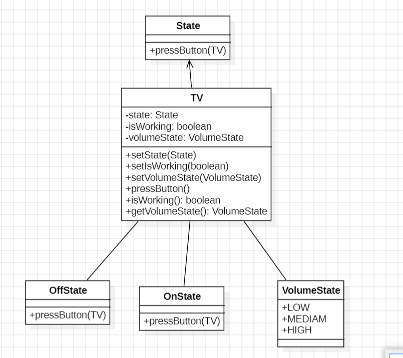

TV Class:

Represents the TV and maintains its state (state), working condition (isWorking), and volume state (volumeState).
Contains methods to set the state, working condition, volume state, and perform an action (pressButton).
State Interface:

Defines the pressButton() method that each state (OnState, OffState) implements.
Concrete State Classes (OnState and OffState):

Implement the State interface and provide behavior for turning the TV on/off based on the current working condition.
VolumeState Enum:

Represents the different volume states (LOW, MEDIUM, HIGH) that the TV can have.

